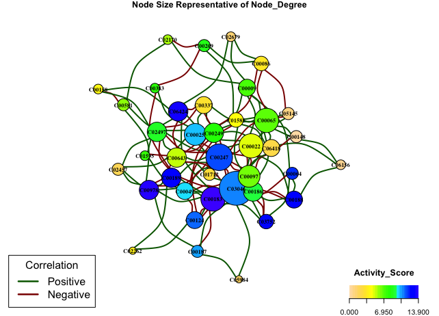
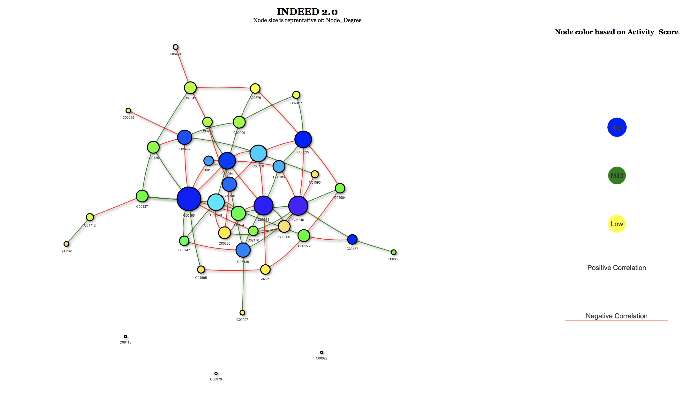

---
output:github_document
---

<!-- README.md is generated from README.Rmd. Please edit that file -->


# INDEED
## Overview


This package implements INDEED algorithm from Zuo et. al.'s Methods paper: INDEED: Integrated differential expression and differential network analysis of omic data for biomarker discovery (PMID: 27592383). 

This R package will generate a csv file containing information such as p-values, node degree and activity score for each biomolecule. A higher activity score indicates that the corresponding biomolecule has more neighbors connceted in the differential network and their p-values are more statistically significant. It will also generate a csv file for the differential network created by INDEED. This package also provides the user with either an interactive network visulaization or non-interactive visualization of the results. 

## Installation

You can install INDEED from github with:


```r
# The development version from GitHub:
# install.packages("devtools")
devtools::install_github("ressomlab/INDEED")
```

## Usage


```r
library(INDEED)

# Example 1:
# Using partial correlation to obtain sparse differential network
pre_data <- select_rho_partial(data=Met_GU,class_label = Met_Group_GU,id=Met_name_GU,error_curve = "YES")
result1 <- partial_cor(data_list=pre_data,rho_group1='min',rho_group2="min",permutation = 1000,p_val=pvalue_M_GU,permutation_thres = 0.05)


# Example 2:
# Using Spearman correlation to obtain differential network
result2 <- non_partial_cor(data=Met_GU,class_label = Met_Group_GU,id=Met_name_GU,method="spearman",permutation_thres = 0.05)

# Visualization Example 1:
# Non-Interactive Visualization of Partial Correlation
network_display(results = result1, layout = 'nice', nodesize = 'Node_Degree', nodecolor = 'Activity_Score', edgewidth = 'NO')


# Visualization Example 2: 
# Interactive Visualization of Spearman Non-Partial Correlation
networkVis(results = result2, layout= 'nice', nodesize= 'Node_Degree', nodecolor= 'Activity_Score', edgewidth= 'NO')

```
Non-Interactive Network Example


Interactive Network Example

